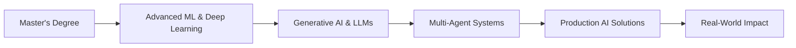

<div align="center">
  
</div>

<div align="center">
  
  ### 🚀 AI Engineer | MSc Student @ Paris Dauphine–PSL
  
  [](https://linkedin.com/in/chiheb-guesmi)
  [](mailto:chiheb.guesmi@dauphine.eu)
  [](https://github.com/chihebguesmi11)
  
  
  
</div>

---

## 👨‍💻 About Me

I'm an **AI Engineer** passionate about building intelligent systems that solve real-world problems. Currently pursuing my **Master's in Artificial Intelligence, Systems and Data** at Université Paris Dauphine–PSL (Excellence Scholarship recipient).

My focus areas include:
- 🤖 **Generative AI & LLMs**: Building production-ready AI applications with RAG, LangChain, and multi-agent systems
- 🧠 **Agentic AI**: Designing autonomous agents with MCP protocol for complex task automation
- 📊 **ML Engineering**: From model development to deployment, with expertise in Deep Learning and NLP
- ☁️ **MLOps**: Deploying scalable AI solutions on cloud platforms (GCP)

```python
class ChihebGuesmi:
    def __init__(self):
        self.location = "Paris, France 🇫🇷 | Tunis, Tunisia 🇹🇳"
        self.education = "MSc AI, Systems & Data @ Paris Dauphine-PSL"
        self.interests = ["Generative AI", "LLMs", "Multi-Agent Systems", "NLP", "Deep Learning"]
        self.current_focus = "Building AI solutions from analysis to production deployment"
        self.hobbies = ["🎸 Guitar", "🎬 Cinema & Film Analysis", "🎵 Music"]
    
    def say_hi(self):
        print("Thanks for stopping by! Let's build something amazing together 🚀")

me = ChihebGuesmi()
me.say_hi()
```

---

## 🛠️ Tech Stack

### Languages


### AI/ML & Deep Learning


### Generative AI & LLM Tools


### Data & Analytics


### Cloud & Tools


---

## 🚀 Featured Projects

### 🩺 [SymptomAI-MCP](https://github.com/chihebguesmi11/SymptomAI-MCP)
> End-to-end demonstration of the Model Context Protocol (MCP) with FastAPI
- Built a medical AI assistant using **MCP protocol** with **LangChain + Gemini + FastAPI**
- Implements symptom extraction and diagnosis suggestion pipeline
- Showcases browser-to-AI-structured results workflow
  
**Tech:** `Python` `LangChain` `Gemini` `FastAPI` `MCP`

### 🧬 [LLMAgentResearcher](https://github.com/chihebguesmi11/LLMAgentResearcher)
> LangGraph agent for extracting biochar information from research papers
- Autonomous research agent using **LangGraph** and **Gemini AI**
- Automated extraction of scientific data from academic papers
- Multi-step reasoning for complex information retrieval
  
**Tech:** `Python` `LangGraph` `Gemini` `NLP`

### 🌍 [CSRimpactGPT](https://github.com/chihebguesmi11/CSRimpactGPT)
> LLM-powered RAG system for CSR recommendation (Hack for Good project)
- **RAG chatbot** with **GPT-4** for CSR initiatives aligned with marketing goals
- Vector database integration for semantic search
- Winner project showcasing real-world business impact
  
**Tech:** `Python` `GPT-4` `RAG` `Vector DB` `LangChain`

### 📄 [Monte-Carlo-RAG-Assistant](https://github.com/chihebguesmi11/Monte-Carlo-RAG-Assistant)
> RAG system for Monte Carlo simulation queries with French PDFs
- **LangChain pipeline** with **ChromaDB** and **HuggingFace embeddings**
- Cross-lingual document querying (French PDFs → English queries)
- Production-ready RAG architecture
  
**Tech:** `Python` `LangChain` `ChromaDB` `HuggingFace` `RAG`

### 🧠 [Mental-Health-Text-Classifier](https://github.com/chihebguesmi11/Mental-Health-Text-Classifier)
> Reddit-based mental health classifier with tailored suggestions
- Fine-tuned **DistilGPT** model achieving **85% accuracy**
- Generates personalized mental health recommendations
- End-to-end NLP pipeline from data collection to deployment
  
**Tech:** `Python` `DistilGPT` `NLP` `Deep Learning` `Transformers`

### 📊 [Transformers-Report](https://github.com/chihebguesmi11/Transformers-Report)
> Deep dive into Transformer architecture and prompt engineering
- Comprehensive analysis from attention mechanisms to instruction tuning
- Technical documentation on modern LLM architectures
- Academic research on prompt design strategies
  
**Tech:** `Research` `Transformers` `NLP` `LLMs`

---

## 📊 GitHub Statistics

<div align="center">
  
  
</div>

<div align="center">
  
</div>

<div align="center">
  
</div>

---

## 🏆 Achievements & Certifications

<div align="center">
  
</div>

### 📜 Certifications
- 🎓 **NVIDIA Deep Learning Institute** - Deep Learning Fundamentals
- 🎓 **DeepLearning.AI** - Supervised Machine Learning
- 🎓 **IBM** - Cognos Analytics
- 🎓 **Coursera** - SQL for Data Science

### 🎖️ Notable Achievements
- 🏅 **Excellence Scholarship** recipient at Université Paris Dauphine–PSL
- 🏆 **Top 10%** (89.8th percentile) on Kaggle House Prices competition
- 🌟 **Hack for Good** winner with CSRimpactGPT project

---

## 💼 Professional Experience

### 🔷 AI Engineer Intern @ **Talan** (Jul 2025 - Sep 2025)
- Implemented **generative AI solutions** with multi-agent systems for business strategy evaluation
- Designed multi-agent architectures with **shared memory**, **tools**, and **coordination protocols**
- Developed AI pipelines with **federated learning** for distributed training
- **Stack:** Generative AI, RAG, LangChain, LangGraph, LLMs, Multi-agent systems, MCP

### 📊 Data Analyst Intern @ **Medianet X Startup Village** (Feb 2024 - May 2024)
- Built real-time **Power BI dashboards**, improving decision-making efficiency by **20%**
- Integrated **ML models** into BI systems, increasing forecast accuracy by **15%**
- Enhanced data quality, reducing reporting errors by **30%**
- **Stack:** Power BI, Python, SQL, Talend, Time Series

### 🤖 Data Scientist Intern @ **1waydev** (Jul 2023 - Aug 2023)
- Developed high-performing chatbot with **RASA NLU**, handling **150+ weekly interactions**
- Analyzed unstructured data to identify user trends and improve strategy
- **Stack:** Python, RASA, NLP, APIs

---

## 🎯 Current Focus



- 🎓 Completing **Master's in AI, Systems and Data** at Paris Dauphine–PSL
- 🔬 Exploring **multi-agent systems** and **agentic AI frameworks**
- 🏗️ Building end-to-end AI solutions from concept to production
- 📚 Learning advanced topics: **Reinforcement Learning**, **Big Data**, **GCP**

---

## 🌐 Let's Connect!

I'm always open to collaborating on innovative AI projects, discussing the latest in ML/AI, or just having a chat about technology and music! 

<div align="center">
  
  [](https://linkedin.com/in/chiheb-guesmi)
  [](mailto:chiheb.guesmi@dauphine.eu)
  [](https://github.com/chihebguesmi11)
  
</div>

---

<div align="center">
  
  
  ### ⭐️ From [chihebguesmi11](https://github.com/chihebguesmi11) with 🎸 and ☕
  
  *"Transforming business needs into concrete AI solutions"*
</div>
